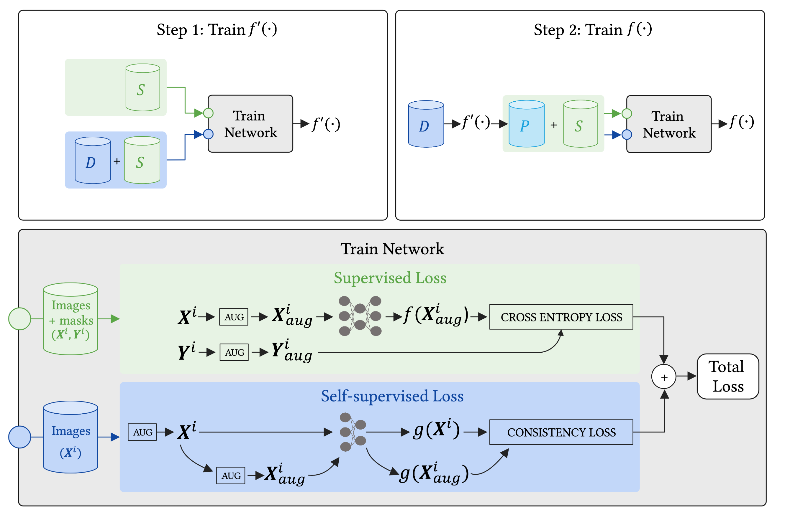

Medallion: training medical image segmentation models with less labeled data.
=======================================================================================================

This is the codebase for our paper, "Evaluating semi-supervision methods for medical image segmentation: applications in cardiac magnetic resonance imaging," published in the Journal of Medical Imaging, 2023. The paper can be found at JMI (https://pubmed.ncbi.nlm.nih.gov/37009059/), or in my dissertation with a few updated results (https://stacks.stanford.edu/file/druid:mx843ys4683/Sarah_Hooper_PhD_Dissertation_Final-augmented.pdf, starting on page 64).

Overview
--------

Collecting large, labeled datasets for training medical image segmentation neural networks is time-consuming and expensive. In this codebase, we use uncertainty-based data augmentation, a consistency loss, and pseudo labeling to bring down the cost of training medical image segmentation models. We rely on a small amount of labeled data and large amounts of unlabeled data to train segmentation models. 

Our codebase is flexible for different segmentation targets and datasets. Below, we walk through how to use this codebase to train and evaluate a segmentation model using our approach. We will use the public cardiac MRI ACDC dataset as a running example and train a segmentation model with 5 labeled image volumes and additional unlabeled image volumes. We'll note where and how to customize the code to your own segmentation data.

Note that Medallion is still *actively under development*, so feedback and
contributions are welcome. Submit bugs in the Issues section or feel free to
submit your contributions as a pull request.

|Medallion|

Getting started
---------------

To use Medallion, you will need to clone this branch and install other Python dependencies by running the following commands (using Python 3.6-3.9):

.. code:: bash

  git clone https://github.com/sarahmhooper/medallion.git
  cd medallion
  make dev

We recommend using a virtual enviroment. Installation should finish in less than 10 minutes.

Walkthrough
---------------

0. Ensure installation was successful
^^^^^^^^^^^^^^^^^
Run the following command from the ``scripts`` directory to ensure the installation was successful. 

.. code:: bash

  bash install_check.sh

This command will use the provided example data files to train a network on 2 image volumes (1 labeled, 1 unlabeled) for 10 epochs. This command completes within a few minutes using a single NVIDIA Tesla P100 GPU, and if successful, should end without error and print the line ``Evaluating example_task (train): 100%|████████████████| 2/2 [00:00<00:00,  3.34it/s]`` when finished.

1. Prepare data
^^^^^^^^^^^^^^^^^

To use this codebase directly on your own data, you will need to reformat your data as numpy files, create a data config file, and optionally create a CSV file specifying which data to train on.
We describe how to complete these steps below and provide example files for each.

Data should be stored in the ``data`` directory with the following format:

.. code-block:: text

  data/
  └-task_name/
    ├-train
      ├-patient_0_image.npy
      ├-patient_0_seg.npy
      ├-patient_1_image.npy
      └-...
    ├-val
      ├-patient_2_image.npy
      ├-patient_2_seg.npy
      ├-patient_3_image.npy
      ├-patient_3_seg.npy
      └-...
    ├-test
      ├-patient_4_image.npy
      ├-patient_4_seg.npy
      ├-patient_5_image.npy
      ├-patient_5_seg.npy
      └-...
    └-config.yaml

**Format data as numpy files.**

We use numpy files to standardize how data is read into the codebase. If you have alternative file formats (e.g., DICOM, NIFTI, jpg), preprocess your data and store it in numpy files prior to training a model.

Each numpy file should be stored as a three-dimensional array, HxWxD. If you are working with 2D images, store each 2D image with three dimensions, where D=1 (e.g., a chest x-ray might have shape 224x224x1). Note that our codebase treats each slice in the depth dimension as a different training sample for training a 2D segmentation model. Each image should be named ``patient_ID_image.npy`` and each corresponding segmentation mask should be named ``patient_ID_seg.npy``.
The patient identifiers (e.g., ``patient_0``, ``patient_1``) can be chosen by the user to uniquely identify each patient. However, we require that each image file ends with ``_image.npy`` and each ground truth segmentation file ends with ``_seg.npy.`` Not every training image needs to have a corresponding segmentation mask; any image without a corresponding segmentation mask will be used as unlabeled data for the self-supervised loss. However, each image in the validation and test directories should have a corresponding ground truth segmentation mask during training. Example numpy files are included in the ``data/example_task`` folder. 

*Tip: To keep data loading quick, apply all non-random preprocessing operations, like resizing and windowing, to your images prior to saving them as numpy arrays. That being said, we do supply resizing and histogram equalization preprocessing in the codebase to apply on-the-fly, if desired.*

**Create config file.**

The ``config.yaml`` file contains required data descriptions:

.. code-block:: yaml

  num_classes: 2
  label_mapping: 
    class1_name: 1 # No need to list class 0 (background)
    
An example config.yaml file is included in ``data/example_task``. The config file indicates the class name of each segmentation target in the numpy files (e.g., masks with label 1 in the numpy segmentation files belong to class1_name). Label 0 is assumed to be background and does not need to be listed in the config file, but should be counted in the number of classes. Note that labels need to be consecutive (e.g., 0, 1, 2...).

**Create labeled data csv.**

Our codebase relies on labeled and unlabeled data during training. To specify which images should be used as labeled data, you can do one of the following options:

* **Option 1**. Specify a CSV file indicating which images to treat as labeled data. The path to this CSV file will be passed as an arg into the training script. This CSV should contain the patient IDs and slice indices of the images to use as labeled data. An example CSV for using 5 patients' labeled data is provided in ``scripts/csv_samplers``, and a notebook for automatically creating CSVs is provided in ``notebooks/create_csv.ipynb``. This option is appropriate if you only want to use a subset of the available ground truth segmentation masks to train the segmentation network. 

    .. code-block:: text

      example_label_specification.csv
      
      
      patient_0,0
      patient_0,1
      patient_0,2
      patient_0,3
      patient_1,0
      ...

 
* **Option 2**. Do not specify a CSV file. By default, the codebase will use all available segmentation masks stored in ``data/task_name/train``. Whichever patient IDs only have image numpys will be used as unlabeled data for the self-supervised loss. This option is appropriate if you want to use all available segmentation masks to train your network. 

2. Train and evaluate a model 
^^^^^^^^^^^^^^^^^

To train and evaluate the segmentation model, we provide ``train_and_eval.sh``. After creating the numpy files, data config file, and CSV flie, simply modify the bash file for your task and run the following from the ``scripts`` directory:

.. code:: bash

  bash train_and_eval.sh

After the command completes, the following files will be saved in ``logs``: the best-performing model, optimizer, and scheduler (``best_model...pth``); config files (``cmd.txt``, ``config.txt``, ``config.yaml``); a training log (``emmental.log``); a tensorboard events file; summary of performance metrics (``metrics.txt``); and predictions from the best model (in ``final_preds/``). 

Each argument in the bash script can be adjusted to fit a specific application. For more detailed options, run ``image_segmentation -h``.
Running the script as written on the ACDC dataset will train a segmentation model with 5 labeled image volumes and additional unlabeled image volumes (we used 85 additional unlabeled training volumes) using the method proposed in our manuscript. The model should achieve an average Dice score of 88 on the test set after 16 hours training on an NVIDIA RTX A6000 GPU; for comparison, using this code to train a fully supervised model (with 90 labeled volumes) should achieve an average Dice score of 91 on the test set, while a naive model trained with only 5 labeled image volumes should achieve an average Dice of 80 on the test set. 

Finally, we provide a simple ``eval_only.sh`` script to load a saved model and predict segmentation masks for a dataset.

.. code:: bash

  bash eval_only.sh

If you wish to evaluate a trained model on a test dataset without ground truth labels, simply set ``eval_segpath=None`` in ``eval_only.sh``.

3. Visualize results
^^^^^^^^^^^^^^^^^

To visualize the results, we provide utils in ``notebooks/review_results.ipynb``. 

Additional customizations
---------------

The current codebase should run on a new dataset provided the setup specified above. If you wish to make modifications, we provide a brief description of common modifications below.

* **Train a naive segmentation model.** To train a naive segmentation model (i.e., only using the available labeled data with random data augmentations), make the following modifications to ``train_and_eval.sh``: set ``consistency_datapath=None``; set ``augment_k=1``; comment out everything after the first call to image_segmentation (i.e., comment out ``resave_psuedo_labels.py`` and the second call to ``image_segmentation``). Note that you can still specify which images to train on using the csv: set ``csv_fn=None`` to train on all available image+segmentation pairs, or specify a training csv to train a naive model on only a subset of the available data.
* **Change the hyperparameters.** Hyperparameters can significantly change training time and network performance. Most hyperparameters can be specified in the bash file (run ``image_segmentation -h`` to see a list of all parameters you can specify). Learning rate and number of epochs should be selected carefully for your application. Using the self-supervised loss by specifying ``consistency_datapath`` should improve performance in the limited labeled data regime, particularly when additoinal unlabeled data is available. Increasing ``augment_k`` to 4 can help improve performance, but it will slow down training---we recommend increasing ``augment_k`` after you've debugged your code and tuned the other hyperparameters. Preprocessing with a histogram equalization (``hist_eq=True``) often helps on MR images. Remaining hyperparameters you can tune (but, in our experience, impact performance a bit less than those aforementioned) include: the uncertainty threshold for the pseduo labels (``uncertainty``), regularization parameters (e.g., ``l2``), the learning rate scheduler, and ``n_sup_batches_per_step``/``n_unsup_batches_per_step``.
* **Add a new model architecture.** To specify a new model architecture, define the model in ``dauphin/image_segmentation/models/architectures.py``. Additionally, include your architecture in ``dauphin/image_segmentation/models/__init__.py``, the task files in ``dauphin/image_segmentation/tasks``, and as a model choice in ``bin/image_segmentation``.  
* **Change the data augmentations.** You can alter the set of data augmentations used during training in ``dauphin/image_segmentation/augment_policy.py``. To modify or add an augmentation function, adjust the ``dauphin/image_segmentation/transforms`` directory.
* **Modify the dataloaders.** You can change the dataloaders (e.g., to add preprocessing operations or read in a new format of data) in ``dauphin/image_segmentation/datasets`` and the call to the dataloaders in ``dauphin/image_segmentation/data.py``.

Reference
---------

If you use this repository, please cite our JMI paper.

Acknowledgments
---------------

- Our framework is built on a multi-task learning package Emmental_.
- Our code for data augmentation framework is based on Dauphin_.

.. _Emmental: https://github.com/SenWu/emmental
.. _Dauphin: https://github.com/senwu/dauphin

